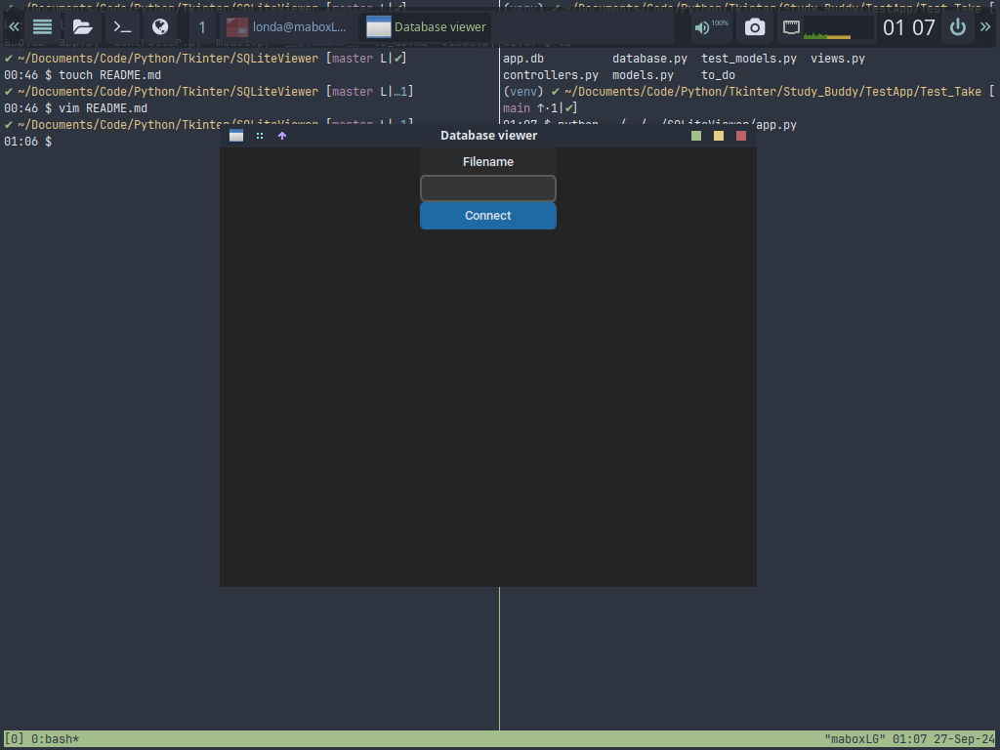

# SQLiteViewer

This is a Sqlite database GUI viewer.

## Why this exist?

I was working on a test taking app and reading the database everytime I made a change was getting in the way of making progress so I built this to make that easier.


## Quick Start

Clone this repo
```bash
git clone <this_repo>
```

Create a virtula environment
```bash
python333 -m venv env
```

Activate it.
```bash
source env/bin/activate
```

Install requirments
```bash
pip install customtkinter
```

Run the application from the directory with your database.
```bash
python ../SQLiteViewer/app.py
```
Or copy the database you want to read to this directory
```bash
python app.py
```

## Usage

Run the application


Type the local sqlite database name


Click connect. Then every time you make a change click refresh to see it.


## Contributions

If you'd like to contribute, please fork the repository and open a pull request.
